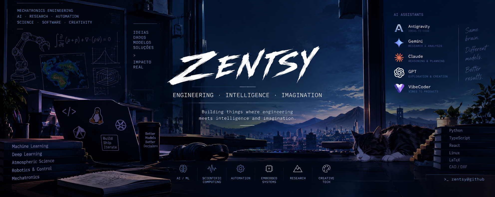

<div align="center">



</div>

<h1 align="center">Zentsy</h1>

<p align="center">
  <strong>Mechatronics Engineering · Artificial Intelligence · Research · Creative Technology</strong>
</p>

<p align="center">
  Building things where <strong>engineering meets intelligence and imagination.</strong>
</p>

---

## 🧠 About Me

I'm a Mechatronics Engineering student interested in **Artificial Intelligence, Machine Learning, scientific computing, automation, and creative technology**.

I like understanding difficult things, turning ideas into working systems, and exploring the space between **engineering, software, mathematics, and AI**.

---

## 🚀 Featured Projects

### 🌧️ THOR-PIML

**Physics-Informed Machine Learning for precipitation forecasting.**

A research project combining deep learning with physical constraints to model precipitation while incorporating knowledge from atmospheric physics.

`Python` `LSTM` `Attention` `PIML` `Meteorological Data`

→ **[View Project](https://github.com/Zentsy/THOR-PIML-Conic2026)**

### 📖 MangAI Translator

**AI-assisted manga translation.**

A translation workflow built around human-AI collaboration, using AI to assist the translator while keeping creative and linguistic decisions under human control.

`TypeScript` `AI` `React` `Manga`

→ **[View Project](https://github.com/Zentsy/MangAItranslator)**

### 🧩 Aether-Board

**An infinite engineering canvas with LaTeX rendering.**

A workspace for mathematical and technical thinking, bringing equations, ideas, and engineering workflows together in a visual environment.

`Python` `Engineering` `Mathematics` `LaTeX`

→ **[View Project](https://github.com/Zentsy/Aether-Board)**

---

## 🤖 My AI Workflow

I use AI as a core part of how I build software.

**AI / Vibe Coding**

`Antigravity` `Gemini` `Claude` `GPT`

**Development**

`Python` `TypeScript` `JavaScript` `React` `Vite` `Git`

**Scientific Computing**

`NumPy` `Pandas` `PyTorch` `Matplotlib` `LaTeX`

> **Vibe coder with engineering standards.** 😌

---

## 🔬 Current Focus

```text
Artificial Intelligence
        │
        ├── Machine Learning
        ├── Physics-Informed Models
        ├── Scientific Computing
        │
        └── Creative AI
                │
                └── Human × AI Collaboration
```

Currently exploring projects involving **AI research, engineering systems, scientific data, and creative applications of technology**.

---

## 🛠️ Engineering × Technology

- 🤖 Artificial Intelligence & Machine Learning
- ⚙️ Mechatronics & Automation
- 🌦️ Scientific & Meteorological Computing
- 💻 Software Engineering
- 🧪 Research & Experimental Projects
- 🎨 Creative Applications of AI

---

## 📊 GitHub

<div align="center">


</div>

---

<div align="center">

<i>Curiosity is a good engineering tool.</i>

</div>
